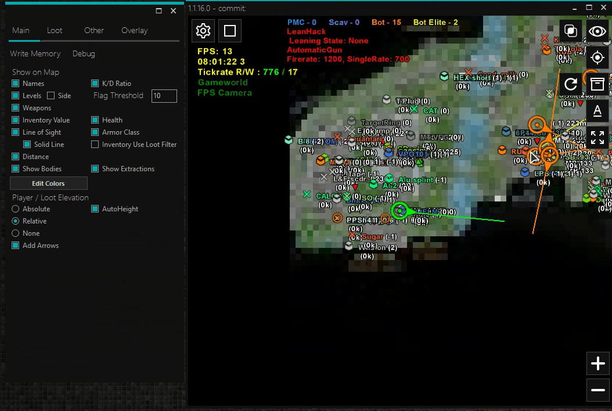

# Shaliuno's NormandyNET
# 2D Radar

A simple OpenGL powered 2D radar for Escape From Tarkov backed by network socket communication.
See my old project as this one is based on it. (downbelow)

## Authors

- [@shaliuno](https://www.github.com/shaliuno)

## Demo

MP4:
https://i.imgur.com/LmVx30O.mp4

GIF:
https://i.imgur.com/LmVx30O.gif

## Features

### Players
- Names
- Levels
- Weapons
- Value of their inventory
- Line of Sight
- Distance meter
- Elevation meter
- K/D ratio
- Health
- Armor and Helmet class
- Various colors to set it all up

### Loot
- Search bar
- Categories
- Price filtering
- Priority filtering
- Live loot as well
- Tons of loot settings to be honest

### Write Memory Feature:
- No Recoil
- Pink Dudes
- Unlimited Stamina
- Aimbot
- Skill Hack
- No Weapon Overheat
- No Weapon Jam
- No Inertia
- No Visor
- Thermal Vision
- Night Vision
- Loot Through Walls
- Fly Hack
- Time Scale aka SpeedHack
- Always Allow Sprint

###  and many more...

## Run Locally

Clone the project

Compile radar

Compile usermode server

Run EFT without Anticheat

Go play offline mode

Run Usermode server on PC where EFT is running

Take a note of EFT process ID (PID)

Run Radar on second PC or same PC

Click start button (the play one)

Enter IP address of that PC

Enter port (default:11000)

Enter PID you took note earlier

Enjoy

## Riddle

Are you able to solve the Riddler's riddles?
Here is one.

One lives with a woman

She stays all day at home

Girl lives on his money

Not working at all

Once cheated on him

Now raising two kids

Is he the father?

Honestly nobody bothered

Who is he?

Man with the steel balls or omega cuckoo.

## Feedback

If you have any feedback or something, please reach out to me at UC or irbisi (at) list.ru.

## License

[AGPL 3.0](https://choosealicense.com/licenses/agpl-3.0/)

## Related

My previous project I used as a base:
[shaliuno's radar, esp and whatever](https://www.unknowncheats.me/forum/escape-from-tarkov/320336-shaliunos-radar-esp-whatever.html)

As I removed original repository here are active forks you can look at:
[active works of old shaliuno's radar project](https://techgaun.github.io/active-forks/index.html#https://github.com/delocker/nautilusft)

P.S.:
Take a look at
https://github.com/delocker/nautilusft/blob/master/NautilusFT/Core/EntityPlayerListCache.cs

and compare to Modules / EFT / EntityPlayer.cs.
You will see a lot of similarities.

## Lessons Learned

A friend in court is better than a penny in purse.

## Support

You may ask, I may answer.

## FAQ

#### Can I use that on Live servers?

Yes, but you have to make AntiCheat bypass and alter the radar socket communication code to work with your impementation.
See user mode and driver impementation to figure it out.

#### Offsets up to date?

Pretty much.

#### I think I saw it somewhere.

Probably you've seen my old repository. Anything else is a simple coincidence.

#### No git commit history, commentaries?

I have the same project that is full of commentaries, has git history for the last several years, with links right from NautilusFT, a bit better code and more feature rich.
For learning purposes this one is plenty already.

## P.S.

preved medved, ezli ti jedo chidaezh tagda nam po puiti
chirgani, pabazarim